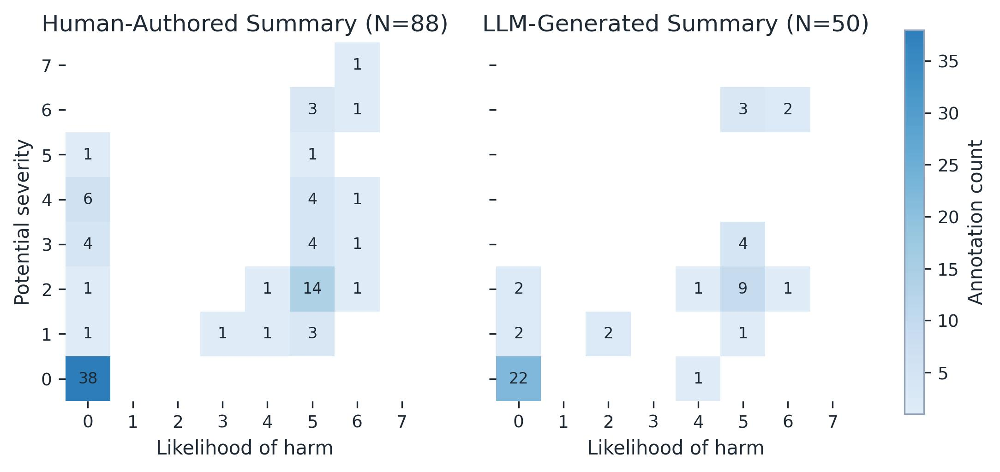

**Figure 1. Heat map of physician reviewer annotated error counts and harm ratings by summary type. Each cell counts error annotations with the corresponding potential-severity and harm-likelihood ratings on the 0-7 scales.**
