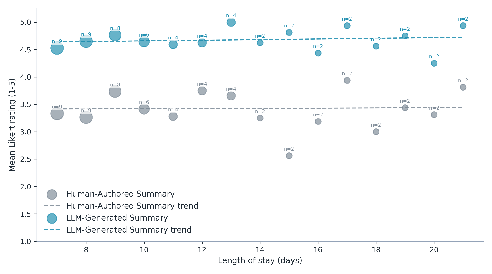

**Figure 2. Scatterplot comparing mean survey ratings to length of stay for both human-authored and LLM-generated discharge summaries (n = 60). Individual values of n above each data point indicate the number of encounters available to calculate the average.**

Length-of-stay association tests use two-sided Spearman rank correlation at the encounter level.

| Summary type | n | Review summaries | Spearman rho | P value |
| --- | --- | --- | --- | --- |
| Human-Authored Summary | 60 | 120 | 0.027 | 0.837 |
| LLM-Generated Summary | 60 | 120 | 0.138 | 0.292 |
